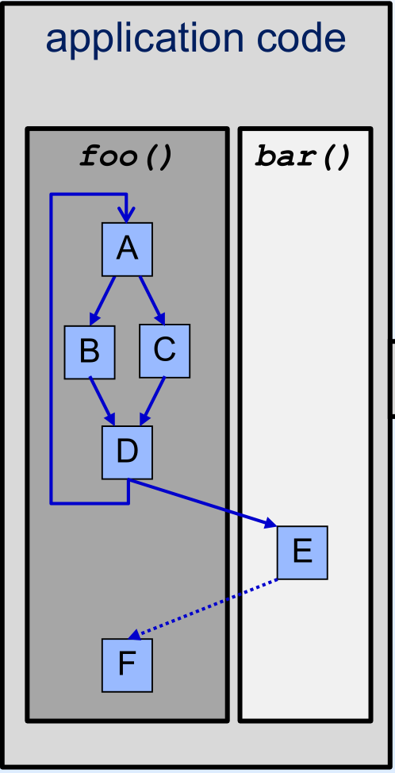
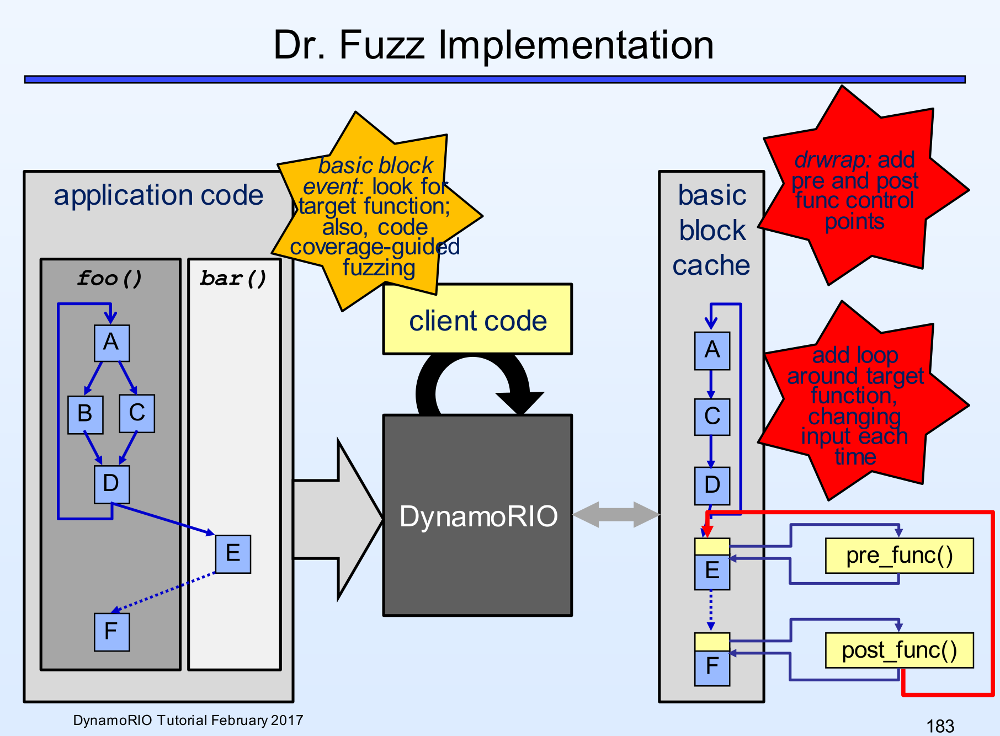

% CS4910: Dynamic Binary Instrumentation
% Andrew Fasano
% Jan 25, 2022

# Background concepts

## Basic blocks
A **basic block** of code is a sequence of instructions
 that will always do the same thing, unconditionally.

Definitions vary depending on who you ask:

* QEMU: Block ends at control transfer
* IDA & Ghidra: Block includes function calls / syscalls

Benefit of analyzing blocks over instruction list

* More compact, same information

## Three blocks, assembly:
```
xor rax, rax
inc rax, 39
syscall
cmp rax, 0
jlt 0x1000
je 0x2000
```

Blocks are split at the syscall instruction and the jumps

## Multiple blocks, C:
```
int y = 0;
x += 1;
if (x > 5) {
    y = 1;
}
printf("%d", y);
```

Where would this be split?

## Block visualization in IDA
Subset of PHP's implementation of base64encode in MIPS


## Library hooking
OSes usually have a way to intercept dynamic symbol resolution.

### Linux: LD\_PRELOAD
* Env variable set to an absolute path to a shared object (.so)

### OS X: DYLD\_INSERT\_LIBRARIES
* Additionally set DYLD\_FORCE\_FLAT\_NAMESPACE=1

### Windows: AppInit DLLs
* Path to a DLL stored in registry (blocked by secure boot)


## Example Hook Target
```
#include <time.h>
#include <stdio.h>

int main(int argc, char **argv){
    if (time() % 86400 == 0) {
        puts("Win!\n");
        return 0;
    }
    puts("Lose\n");
    return 1;
}
```

Example from [systemoverlord.com](https://systemoverlord.com/2014/01/13/ld_preload-for-binary-analysis/)

## Hook Library
```
#include <time.h>
#include <stdlib.h>

time_t time(time_t *out){
    char *tstr = getenv("TIME");
    if (tstr)
        return (time_t)atol(tstr);
    return (time_t)0;
}
```

Compile with `gcc -Wall -fPIC -shared -o time.so time.c`
Run with `TIME=0 LD_PRELOAD=`pwd`/time.so ./timechall`

## Realistic Hooking
* Argument logging
* String comparisons
* Preeny library for exploitation: [github/zardus/preeny](https://github.com/zardus/preeny)
    * Disable alarms, randomness, sleep, etc.

## Persistent Hooking
Shared libraries listed in `/etc/ld.so.preload` will be
loaded for every program as if they were set via LD\_PRELOAD

Unsurprisingly, this is often used by malware!

## System calls for process control
Linux processes are created and programs are started or ended using:

* fork: split a process into two
* execve: replace the current program image with another
* exit: terminate the current process

See `man 2 callname` for full documentation.

But these can't be hooked with LD\_PRELOAD because they aren't library functions.
However, libc's `_init` is and it runs at the start of every process!


## Code Injection
After initial execution of custom code, how can your analysis
examine the rest of the program?

* Read and write code in process memory
    * Insert breakpoints
    * Insert custom code
* Launch a new thread

# DBI: Dynamic Binary Instrumentation

## Dynamic binary instrumentation

Technique for measuring and analyzing what an application is doing while it runs.

DBI frameworks handle injecting code into target application and provide
**callbacks** for analyses to leverage.


## Implementation: interpreter for compiled code

* Fetch next block of code to be executed
* Decode, modify as necessary
    * At minimum: return to interpreter at end of block
* Execute modified code

* This is slower than native execution by a few hundred times!

## Hypothetical Program



Image from [Derek Bruening and Qin Zaho](https://github.com/DynamoRIO/dynamorio/releases/download/release_6_1_0/DynamoRIO-tutorial-mar2016.pdf).

## Optimizations
A well-engineered DBI framework can achieve reasonable performance.

* Basic block caching
* Block chaining
* Branch linking
* Trace caching and building

Together can reduce slowdown from 300x to 1.1x!

See Bruening and Zaho's [slides](https://github.com/DynamoRIO/dynamorio/releases/download/release_6_1_0/DynamoRIO-tutorial-mar2016.pdf) for more details.

## Side Effects
DBI frameworks should not have observable side effects on target

* If an analysis changes program state, the results may be invalid

Can't assume information about target behavior

* Registers used (may violate standard ABIs)
* Stack layout (may read/write above top of stack)

Must split analysis resources (e.g., shared libraries) from guest resources

* Library code might not be re-entrant

## Translation time analyses
Some analyses can be conducted during translation

* Which blocks will be run?
* What is the length of the average instruction?

Cannot examine register or memory values.

## Runtime analysis
Other analyses require analysis code to be run with
the target.

* Read and write registers and memory
* Measure timing 
* Redirect execution

Core DBI framework is implemented as a mix of translation-
and run-time analyses.

## DBI vs debuggers

What about PTRACE?

* Read and write code before it's executed
* Add breakpoints
* Trap back to tracee after each block

**Performance**

## Static binary instrumentation vs DBI

Static binary instrumentation modifies application
at compile time to add analysis logic to binaries.  Example: PEBIL[^1]
 
No need for translation-time analyses; instrumentation is placed
inline with code.

Limitations vs DBI:

* DBI can instrument libraries
* DBI doesn't require source code

Binary rewriting: Can you take a compiled binary, turn it to source and rebuild?

[^1]: [PEBIL: Efficient Static Binary Instrumentation for Linux. Laurenzano et al.](https://citeseerx.ist.psu.edu/viewdoc/download?doi=10.1.1.170.2621&rep=rep1&type=pdf)

# DynamoRIO

## DynamoRIO

Build container from [github/AndrewFasano/DPA-containers](https://github.com/AndrewFasano/DPA-containers).

> DynamoRIO is a runtime code manipulation system that supports code transformations on any part of a program, while it executes.  \[DynamoRIO\] allows arbitrary modifications to application instructions via [an] instruction manipulation library.  - [DynamoRIO.org](https://dynamorio.org)
 
Supports common OSes and i386 + arm based architectures.

{height=90px}

## Callbacks
* Startup
* Basic block creation
* Process start and exit
* Process signal
* System call before/after
* ``Nudges''

## Usage
Run a program under DynamoRIO with a provided tool
```
drrun [options] [DR options] -t <tool> [tool options] \
                             -- <app and args to run>
```

## Available tools and clients
DynamoRIO includes a set of useful analysis plugins (or tools), built in `clients/lib64/release/`.

`api/samples/` contains a collection of clients.

Inside your container, run the drcachesim tool and examine the results:
```
./bin64/drrun -t drcachesim somebinary
```

## DrCacheSim
CPU cache simulator to evaluate performance of different CPU implementations.

* First in first out, Least-recently used, etc.

How could such a tool be built in a DBI framework?

. . .

* Examine instructions which reference memory and store addresses
* Then simulate cache behavior given this list of accesses

## DrCacheSim: Hands On

Change attributes of the L1 cache - can you increase the hit rate?

* Documentation: [dynamorio.org/sec_drcachesim_ops.html](https://dynamorio.org/sec_drcachesim_ops.html)

## Cusom client

Follow along at [dynamorio.org/API_tutorial_bbdynsize1.html](https://dynamorio.org/API_tutorial_bbdynsize1.html)

Instead of fighting build system, will modify `../src/api/bbsize.c` and rebuild, then run with:

```
 ./bin64/drrun -c ./api/bin/libbbsize.so -- ls
 ```

## Dr. Fuzz
DynamoRIO tool for detecting invalid memory accesses

Store correct values in:

* Shadow heap
* Shadow stack

Whenever guest accesses memory, compare to shadow memory

* Update if valid
* Warn if invalid

Other DBI applications for security research?

## Dr. Fuzz

DBI tool for fuzzing 

# DynamoRIO Implementation

## Large and complex software project
* Under development since 1990s
    * RIO at MIT combined with Dynamo at HP Labs
* Today has nearly 700,000 lines of code
* Open sourced in 2009
    * 1,400 open github issues

## Framework Injection

Supports:

* LD\_PRELOAD
* Ptrace
* Direct execution

## Alternative DBI Frameworks:

Intel PIN:

* x86 only
* Less powerful // easier to use
* Closed souce

Frida:

* Injects JavaScript for instrumentation
* Python scripting
* Open source
* Built for mobile, but now supports desktop
* Next week's lecture topic!


## Resources

* https://dynamorio.org/page_slides.html - March 2016 presentation
* https://dynamorio.org
* http://seclab.cs.sunysb.edu/sekar/cse509/ln/binrewr.pdf
* https://titanwolf.org/Network/Articles/Article?AID=0d2a3f5b-449b-48d8-8b67-e0756c2821d0

## Any questions?
