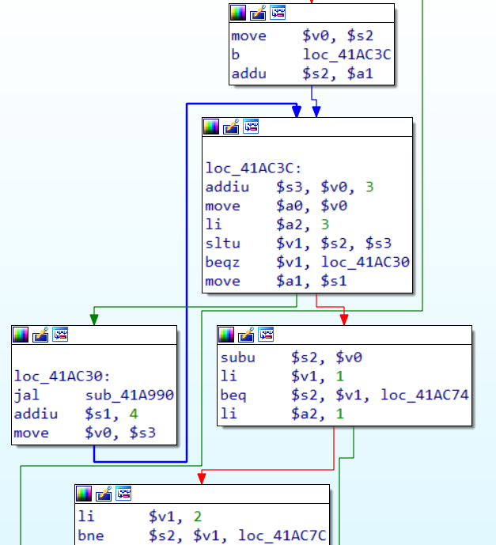

% CS4910: Dynamic Binary Instrumentation
% Andrew Fasano
% Jan 25, 2022

# Background concepts

## Basic blocks
A **basic block** of code is a sequence of instructions
 that will always do the same thing, unconditionally.

Definitions vary depending on why you ask:

* QEMU: Block ends at control transfer
* IDA & Ghidra: Block includes function calls / syscalls

Benefit of analyzing blocks over instruction list

* More compact, same information

## Three blocks, assembly:
```
xor rax, rax
inc rax, 39
syscall
cmp rax, 0
jlt 0x1000
je 0x2000
```

Blocks are split at the syscall instruction and the jumps

## Multiple blocks, C:
```
int y = 0;
x += 1;
if (x > 5) {
    y = 1;
}
printf("%d", y);
```

Where would this be split?

## Block visualization in IDA
Subset of PHP's implementation of base64encode in MIPS




## Library hooking
Dynamically linked programs resolve library symbols at runtime.
OS may allow interception and substitution of these.

Useful for dynamic analysis, but also used by malware

### Linux: LD\_PRELOAD
* Environment variable
* Set to the path to a shared object (.so)

### Windows: AppInit DLLs
* Path to a DLL stored in registry
* Blocked by secure boot


## Example Hook Target
```
#include <time.h>
#include <stdio.h>

int main(int argc, char **argv){
    if (time() % 86400 == 0) {
        puts("Win!\n");
        return 0;
    }
    puts("Lose\n");
    return 1;
}
```

Example from [systemoverlord.com](https://systemoverlord.com/2014/01/13/ld_preload-for-binary-analysis/)

## Hook Library
```
#include <time.h>
#include <stdlib.h>

time_t time(time_t *out){
    char *tstr = getenv("TIME");
    if (tstr)
        return (time_t)atol(tstr);
    return (time_t)0;
}
```

Compile with
```
gcc -Wall -fPIC -shared -o time.so time.c
```


## Library loads
yep

## Code Injection
A process is running code - what if we give it more code to run
    - totallynotmalware.ru
    Another thread
    Modify existing functions in memory
    Pause original execution, replace it, then restore

# DBI: Dynamic binary instrumentation

## stuff
Running a process and you want to instrument what it's doing
or modify it.

Could ptrace it, set breakpoints, read/write registers, etc.
    - But that's slow

What if we just add more code?
    - Like with ptrace, there are some (sane) permissions restrictions
    - i.e., you can't take over a process another user is running unless you're root

But that's hard
    - Injection primatives:
        - How do we start our code
    - Side effects
        - Avoid changing target state in observable/breakable ways
    - Common core
        - Perfect for frameworks


## DBI vs debuggers

Performance

## Static binary instrumentation vs DBI
http://citeseerx.ist.psu.edu/viewdoc/download?doi=10.1.1.170.2621&rep=rep1&type=pdf#:~:text=Static%20binary%20instrumentation%20inserts%20additional,permanent%20modifications%20to%20the%20executable.

Static: rewrite source or during compilation
Instrumentation framework is built in to binary
    - Could still be dynamically configurable

Dynamic:
    - Instrument libraries
    - No source code

Binary rewriting:
    - Somewhere in the middle
    - Not really reliable yet

### Inaccurate
??

### Source code
Don't need it


# DynamoRIO Implementation

## Stuff

# DynamoRIO Usage

## Pre-built Tools

# DynamoRIO API

## Custom Tools


## Resources
https://titanwolf.org/Network/Articles/Article?AID=0d2a3f5b-449b-48d8-8b67-e0756c2821d0

http://seclab.cs.sunysb.edu/sekar/cse509/ln/binrewr.pdf
