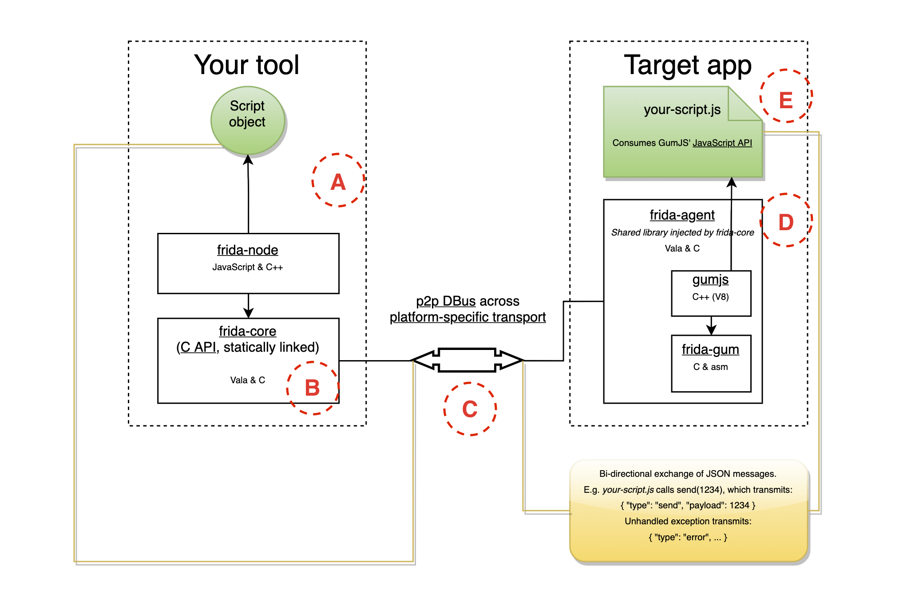

% CS4910: DBI with Frida
% Andrew Fasano
% Feb 1, 2022

# DBI Applications

## But first, a recap
Dynamic binary instrumentation is when compiled binaries are 
modified at runtime in order to accomplish some analysis goal.

Cannot simply run target binaries, instead basic blocks of code are rewritten
at runtime to keep returning control flow to DBI framework.

The core of a DBI framework is hard to implement as it must
not alter target program behavior.


## A few short videos of DBI in the real world

## Reverse engineering

* Angry Birds [https://www.youtube.com/watch?v=nk3rUn2ip0g](https://www.youtube.com/watch?v=nk3rUn2ip0g)

## Dynamic malware analysis

* Malicious android chat app: [https://www.youtube.com/watch?v=07K5DZXMvB4](https://www.youtube.com/watch?v=07K5DZXMvB4)

## Feature Addition

* Quake API [https://www.youtube.com/watch?v=Qk180zKMIfU](https://www.youtube.com/watch?v=Qk180zKMIfU)


# Frida

## Vision: ``The Greasemonkey for native apps''

Greasemonkey browser plugin for JavaScript injection into websites

* Add new features
* Change standard behavior

But websites are made of text (i.e., html, javascript) while applications are code, how can they be modified?

* DBI!

## Frida Overview
Open source DBI framework [github/frida/frida](https://github.com/frida/frida)

Initially just *frida-gum*

* A cross platform code instrumentation library by Ole André V. Ravnås, later with help from Karl Kalleberg.
* Function hooking for debugging

Later added *frida-core*

* Inject libraries into a process
* Used to inject *frida-gum*

Initially released in 2013. Well documented, popular project today.

## Example use cases
From Frida's website, [frida.re](https://frida.re):

* "There’s this new hot app everybody’s so excited about, but it’s only available for iOS and you’d love to interop with it. You realize it’s relying on encrypted network protocols and tools like Wireshark just won’t cut it. You pick up Frida and use it for API tracing."

* "Your in-house app could use some black-box tests without polluting your production code with logic only required for exotic testing."

## Frida Design
Core platform handle low-level DBI details

* Isolated libraries
* Custom glibc to prevent resource leaks

Unlike DynamoRIO, Frida analyses are built in scripting languages
so they're portable across targets!

Frida supports running the interpreter correctly in the target,
scripts don't have to worry about these low level concepts!

## Frida Architecture


Diagram from https://frida.re/docs/hacking/

## Frida Architecture: Components
Frida-[[language]]: bindings for a given language to allow scripting

Frida-core: manages injecting agent into target, handles communications with the agent

Frida-agent: code running inside target, maintaining control of target and running user-requested actions

## Frida Implementation: Initial foothold
Given an already running target, Frida uses **ptrace** to
inject the **frida-agent** into the target process and
take over execution after it had already started.

This approach is also supported by DynamoRIO, though we didn't use it last week.

## Getting started with Frida - system setup

Install either

* Frida container from [github/AndrewFasano/DPA-contianers](https://github.com/AndrewFasano/DPA-containers).
* Or use your host: `pip3 install frida-tools frida`

Get these started now, we'll come back to them in a few minutes

## Frida utilities

### CLI Mode
* Launch a process under Frida or attach to an existing one

### Scripting
* Write analyses in high level languages
* Python, Rust, JavaScript and TypeScript

### Tracing
* Function call tracer
* Understands library 

##  Frida targets

Frida can target other applications runing on your system: `frida-ps`

* Will need to first run `sudo sysctl kernel.yama.ptrace_scope=0` on host

Frida can be installed on Android and iPhones and then targets can be traced via USB debugging


# Frida: Hands On

## Getting started with Frida - CLI mode

To start, we'll simply launch a process under the Frida CLI REPL:
```
$ docker run --rm -it --security-opt seccomp:unconfined \
-v $(pwd):/host frida
root@container:/frida # frida /bin/cat #<-- Aboslute path
  ____
 / _  |   Frida 15.1.14 - A world-class dynamic
| (_| |           instrumentation toolkit
 > _  |  Spawned `/bin/cat`. Use %resume to
/_/ |_|     let the main thread start executing!
```

## Frida CLI commands

This interpreter allows you to interact with the target process via the Frida
JavaScript APIs: [frida.re/docs/javascript-api](https://frida.re/docs/javascript-api/).
Unfortunately the help command doesn't help.

We can dump the code of the current process with
```
[Local::cat]-> const self = Process.enumerateModules()[0];
[Local::cat]-> console.log(hexdump(m.base));
```


## Frida CLI commands II
We can examine modules, symbols and assembly with
```
[Local::cat]-> Module.enumerateImportsSync('cat');
[Local::cat]-> var syminfo = DebugSymbol.fromName('read');
[Local::cat]-> syminfo;
[Local::cat]-> Instruction.parse(ptr(syminfo['address']));
```

Many examples available online: [github/iddoeldor/frida-snippets](https://github.com/iddoeldor/frida-snippets)

## Tracing example

Frida lists targets it can see when you run `frida-ps`.

Frida can *trace* a target's calls to specific functions e.g.,
`frida-trace -i "malloc" -i "free" sqlite3

This generates code in `__handlers__/[libname]/[sym].js` which can be customized

## Frida tracking for heap allocations

Recall LAB01 where we used GDB to hook mmap to trace allocations?

*DEMO*

Modifying generated code to record arguments:
```
log("allocate(0x" + args[0].toString(16) + ")");
```

And return values:
```
onLeave(log, retval, state) {
  log("-> 0x" + retval.toString(16));
}
```


## Frida Python scripting
Start the container with a shared directory and run `cat`

```
$ docker run --rm -it -v $(pwd):/host frida
root@container:/frida # cat
```

Then attach open and attach a second terminal (shell 2):
```
$ docker ps
    CONTAINER ID ... NAMES
    123456789abc ... inspiring_mahavira

$ docker exec -it inspiring_mahavira bash
root@container:/frida # frida cat
```

## Hands on with Frida Python
Run `cat` in your first terminal, in shell 2 run enumerate\_mods.py (download directly from containers repo if you're not using the container)
```
$ docker exec -it inspiring_mahavira bash
root@container:/frida # cat examples/enumerate_modules.py
root@container:/frida # python3 examples/enumerate_mods.py
```

What does the script output?

## Frida Interceptor API

Intercept calls to a function at a target address
```
Interceptor.attach(target, callbacks[, data])
```

Let's use this to script the `frida-trace` command we ran earlier in the Frida REPL!

```
Interceptor.attach(Module.findExportByName(null, "malloc"), {
    onEnter: function(args) {
        console.log("Interceptor attached onEnter...");
    },
    onLeave: function(args) {
        console.log("Interceptor attached onLeave...");
    }
})
```

Then `%resume`

# Wrap up

## Resources

* Frida book: https://learnfrida.info/
* Tracing example: https://monosource.github.io/tutorial/2017/01/26/frida-linux-part1/

## Next assignment:

A02: **Side Channel Coverage Maximization**
Given a provided ``crackme'' program:

* Automatically generates an input for the program
* Record coverage achieved by each input
* Use coverage information to guide subsequent input generation

Smaller than A01 - will be released Thursday.

## Any questions?
* We'll talk about A01 solution after everyone has submitted it
