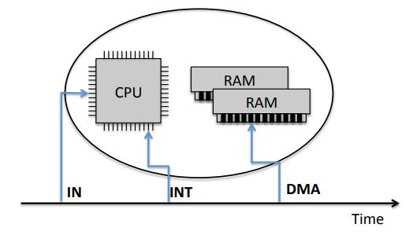
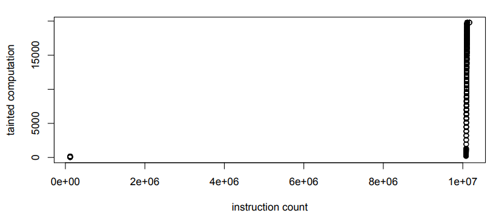

% CS4910: Dynamic analysis with PANDA and QEMU
% Andrew Fasano
% Feb 22, 2022

# Record and Replay

## Record and Replay (RR)

Record and replay is a model for analysis where you:

1) Record some behavior of interest
2) Analyze the recording

This simplifies analysis of a program of system:

* Fully reproducible behavior: bugs always occur
* Recordings can be shared
* Deterministic behavior: nothing changes

## Popular RR systems

[GDB](https://sourceware.org/gdb/download/onlinedocs/gdb/Process-Record-and-Replay.html):

* Start recording with `record`
* Step backwards, reverse continue

[RR-project](https://rr-project.org) from Mozilla:

* User-space record and replay
* Recordings can be replayed under GDB

Microsoft's "[Time Travel Debugging](https://docs.microsoft.com/en-us/windows-hardware/drivers/debugger/time-travel-debugging-overview)":

* User space record and replay for Windows
* Recordings collected and replayed with WinDbg

## RR design

A record and replay system must reliably execute
the same code\footnote{Excluding any recording-specific code which does not affect target behavior} during the recording phase as it runs each
time it is replayed.

Inefficient RR systems are easy to design:

* Record: before instructions, save reg. & mem. state to a log
* Replay: Update registers and memory according to log

Boundary of recording varies between RR system goals:

* Single application vs whole system
* Internal peripheral state or not

## PANDA RR design

PANDA's RR system draws an imaginary line around the CPU and memory of the emulated guest
and records whenever events cross this line.

Recording consists of two files: a snapshot of initial state
and a non-determinism ("nondet") log.

* Snapshot simply stores starting memory and register state
* Nondet log stores all interactions between the CPU and the external world

{height=80px}

## Sources of non-determinism

When the CPU or RAM read from or are modified by the external world (i.e., a peripheral), the
event is logged along with the details of when the event occurred.

Need to uniquely identify when an event occurs:

* Counter of instructions since execution began
* Program counter at time of event
* Loop counter (e.g., `ecx` for x86)

## Replaying events

During replay, PANDA checks the current CPU state to determine if the next event should be replayed.

Emulation logic is modified such that all events which
generate non-determinism will pop an entry from the nondet log.

The details of a popped entry must match what was expected: e.g., 4-byte MMIO read can't return 1 byte.

If replay log diverges, a fatal error is raised.

## Pros and cons of PANDA's RR model

Pros:

* Only capturing the non-determinism during recording greatly reduces
size without sacrificing fidelity (billions of instructions in under 1Gb)
* Does not require engineering effort for each supported peripheral
* Internal peripheral state is not captured

Cons:

* System cannot "go live" from a replay (peripheral state is missing)
* Requires engineering effort for each supported architecture


## PANDA RR demo: Take a recording

Using the PANDA container, take a recording of a guest system, starting with:

1) Run a guest (get command with `python -m pandare.qcows x86_64`)
2) Switch to the monitor (press `ctrl+a` then `c`)
3) Type `begin_record myrecording`
4) Switch back to the guest (press `ctrl+a` then `c`)
5) Run some commands in the guest
6) Switch back to the monitor and end recording (press `ctrl+a` then `c`)
7) Type `end_record` then `quit`

## PANDA RR demo: Replay and analyze the recording

Using the recording you just collected, run PANDA with the
`asidstory` plugin to view the processes running:

```
panda-system-x86_64 -m 1g -replay myrecording \
    -panda asidstory \
    -os linux-64-ubuntu:4.15.0-72-generic-noaslr-nokaslr
```

## Scissors: Trimming PANDA recordings

A replay can be trimmed to a smaller period of time using the `scissors` plugin:

For example, to create a recording called `myrecording_smaller`
which starts at the instruction 1361266 and ends at 4126054, you could run:

```
panda-system-x86_64 -m 1g -replay myrecording \
    -panda scissors:name=myrecording_smaller:start=1361266,end=4126054
    -os linux-64-ubuntu:4.15.0-72-generic-noaslr-nokaslr
```

## PANDA RR Use Cases

Malware analysis:

* MALRec: Severi, Giorgio, Tim Leek, and Brendan Dolan-Gavitt. "Malrec: compact full-trace malware recording for retrospective deep analysis."
* PANDAcap: Stamatogiannakis, Manolis, Herbert Bos, and Paul Groth. "PANDAcap: a framework for streamlining collection of full-system traces."

Reverse engineering:

* Stealing songs from Spotify: [Recon Talk](https://recon.cx/2014/slides/PANDA%20REcon.pdf)
* Memory introspection: Dolan-Gavitt, Brendan, et al. "Tappan zee (north) bridge: mining memory accesses for introspection."


# Dynamic Taint Analysis

## Taint analysis example

```
#define SIZE 100
int *x = (int*)malloc(SIZE*sizeof(int));
for (size_t i=0; i < SIZE; i++) {
    if (i % 27)
        x[i] = f();
    else
        x[i] = g();
}

log(x[15]+15);
log(x[52]+52);
log(x[75]+75);
```

Which of the calls to `log` are using a value derived from `f()`?

## Taint analysis

Taint analysis is the process of tracking information flows from one or more
"sources" to one or more "sinks."

Tainted data may be labeled to distinguish between them.

When a new value is generated, it must be labeled as tainted if it
is based off a previously-tainted value.

Static taint analysis tries to analyze all possible taint flows while
dynamic taint analysis examines the taint flows that occurred during an execution.

## Realistic use cases

A taint analysis can answer questions such as:

* Can this variable be controlled by a user (via the network, environment, stdio, input files, etc.)?
* Will some internal (sensitive) value be leaked from a program or system?
* How much will the tainted data be modified as it flows through the program?

## Taint propagation

The taint of data *propagate* as data are transformed, copied, and stored.

A "taint analysis policy" describes the specifics of how taint propagates. 
Much of this is standardized, but there are some edge cases which vary between systems, for example:

* If an address is tainted should a read from it be tainted or untainted?

A **taint explosion** is said to occur when nearly everything in a program gets tainted rendering most
analyses meaningless. For example, consider what happens if the program counter gets tainted.

## Taint policy sketch

Let's design a simple taint analysis policy to handle:

* Constants
* Binops and unary ops
* Assignments
* Memory loads and stores

## PANDA's taint system

PANDA has a taint tracking system implemented as a plugin, "taint2" in about 10k lines of C++.

* Tracks "label sets" of tainted data (i.e., multiple labels can be applied to the same value)
* Implemented with shadow memory to track taint labels and an LLVM pass to update it as necessary.
* Additional plugins support labeling data as tainted at various events and querying taint.

When running with the taint system enabled, PANDA executes LLVM IR instead of TCG (using code from the open-source S2E system).

## PANDA's taint compute number

Beyond tracking taint labels, PANDA also tracks the "taint compute number" (TCN) of tainted data as follows:

* When tainted data is directly copied, its TCN is also copied.
* When tainted data is modified in order to generate a new value, the TCN of the new data is incremented by 1

TCN is a measure of distance between taint sources and sinks.

{height=100px}

## Using PANDA's taint system: Applying labels

Collect a recording, then on replay enable the taint system by loading the `taint2` plugin.

Label data using plugins such as `file_taint`, `tstringsearch`, `serial_taint` or `tainted_net`.

These plugins can be configured to apply labels in different ways, for example `file_taint` can apply one label per opened file or one label per byte in an opened file.

## Using PANDA's taint system: Querying results

Record or query taint at various locations with plugins such as: `tainted_instr`, `tainted_branch`, `tainted_net`.

Result of taint analyses are typically stored in an output file called the "PANDAlog" or "plog."

* PANDAlog set with `-pandalog foo.plog` argument on CLI or `panda.set_pandalog("foo.plog")` in PyPANDA.
* Read a PANDAlog file with `python -m pandare.plog_reader foo.plog`

Taint-querying plugins may record a large amount of information.

## PANDA taint demo:

* Record the guest reading from `/etc/passwd`
* Replay the recording using `file_taint` with `pos=True` and `tainted_instr` configured to log to out.plog
* Examine the generated PANDAlog to see the tainted instructions

Arguments for replay:
```
-replay passwd -panda file_taint:filename=/etc/passwd,pos=1 -panda tainted_instr -pandalog out.plog 
```

# PANDA OSI

## Operating System Introspection (OSI)

OSI provides analysts with OS-level information about a guest system using "profiles" for the guest kernel.
PANDA OSI can provide information on running processes (name, pid, parent pid), map file descriptors to filenames, and describe memory mappings of processes.

PANDA OSI is split implemented via sub-plugins for Linux (`osi_linux`) and Windows (`wintrospection`).

## PANDA OSI Linux profiles

PANDA's supported profiles are in [kernelinfo.conf](https://github.com/panda-re/panda/blob/dev/panda/plugins/osi_linux/kernelinfo.conf) but
additional profiles can be created locally

Many OSI profile fields are related to the task structure (defined in Linux kernel [sched.h](https://elixir.bootlin.com/linux/latest/source/include/linux/sched.h#L723))
but also file-related properties such as the sizes and offsets of [dentries](https://elixir.bootlin.com/linux/latest/source/include/linux/dcache.h#L91).

## PANDA OSI Linux profile generation

When working with a new guest, profiles can be generated by compiling and loading a custom kernel module or with GDB.

[Kernel module approach](https://github.com/panda-re/panda/tree/dev/panda/plugins/osi_linux/utils/kernelinfo) requires the ability to compile and load a kernel module in the guest.

[GDB approach](https://github.com/panda-re/panda/tree/dev/panda/plugins/osi_linux/utils/kernelinfo_gdb) requires the kernel to be built with debug symbols.

## PANDA OSI Linux implementation

C++ plugin to read guest memory, identify and follow pointers as appropriate and provide usable results.

Example: [get_fd_name()](https://github.com/panda-re/panda/blob/dev/panda/plugins/osi_linux/osi_linux.cpp#L117-L124) function translates a file descriptor to filename.

* Examine the current task structure to get its array of active file structures
* Select the file structure element corresponding the provided FD
* Parse the file structure to extract the filename as a string

# QEMU TCG Plugins

## TCG plugins

As of version 4.2, QEMU has some support for "TCG Plugins" that can analyze guest behavior.

* Supports multicore and multiprocessor guests
* Plugins cannot directly read CPU state, must use APIs
* API is small and limited
* Modifications to guest state are prohibited

Model is based on callbacks and generally similar to PANDA's but with better software development practices.

## Simple TCG plugin example

Initialize plugin with `qemu_plugin_install`

Register callbacks with functions like `qemu_plugin_register_vcpu_tb_trans_cb`

Simple plugin for tracking which blocks are being run: [hotblocks.c](https://github.com/qemu/qemu/blob/master/contrib/plugins/hotblocks.c)


## TCG plugin for coverage

Coverage plugin to generate output in same format as DyanmoRIO's drcov module: [drcov.c](https://github.com/qemu/qemu/blob/master/contrib/plugins/drcov.c)

* On block translation, set up block details and register callback on execution.
* On block execution, update block details to indicate that block was executed.
* At end of execution, write details of all executed blocks to log.

# Wrap-up

## Wrap-up

* Released A02 grades
* A03 due at the end of next Monday (a little earlier than usual)
* Come to office hours on Thursday if you're stuck on A03 or want to talk about A02

Posted a great paper "All you ever wanted to know about dynamic taint analysis and forward symbolic execution (but might have been afraid to ask)."
on Canvas for anyone who wants to learn more about dynamic taint analysis.

## Lecture resources

* Dolan-Gavitt, Brendan, et al. ["Repeatable reverse engineering with PANDA."](https://messlab.moyix.net/papers/panda_pprew15.pdf) Proceedings of the 5th Program Protection and Reverse Engineering Workshop. 2015.

* Schwartz, Edward J., Thanassis Avgerinos, and David Brumley. "All you ever wanted to know about dynamic taint analysis and forward symbolic execution (but might have been afraid to ask)." 2010 IEEE symposium on Security and privacy. IEEE, 2010.

* https://qemu.readthedocs.io/en/latest/devel/tcg-plugins.html
