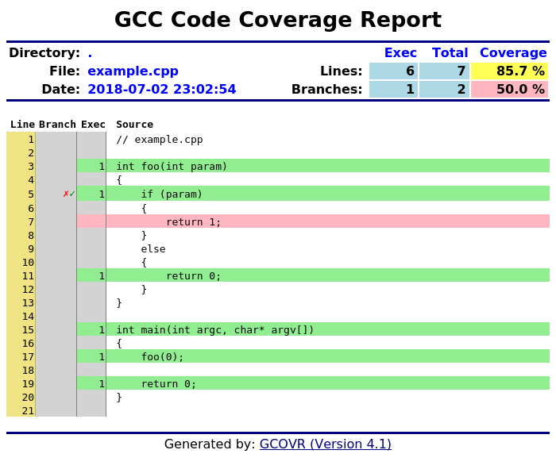
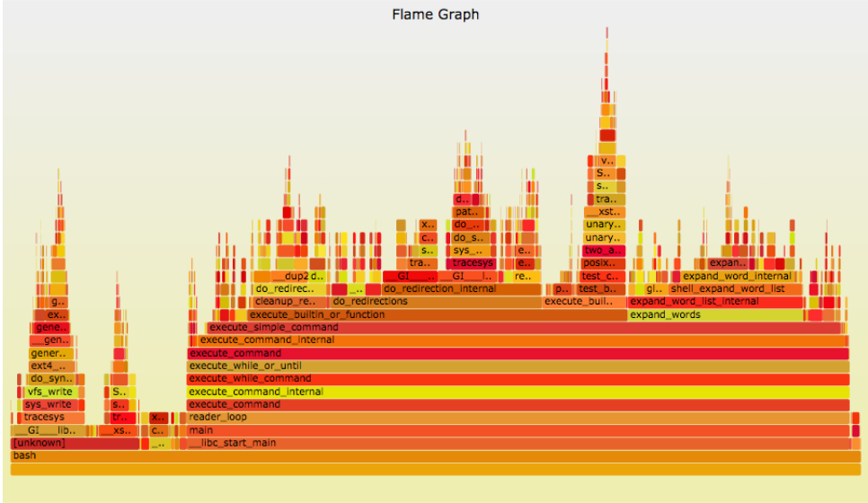

% CS4910: Application Profiling
% Andrew Fasano
% Feb 29, 2022

# Profiling

## Motivation: Grand Theft Auto Online

In 2021, GTA Online was taking 6 minutes to load.
The hacker *T0ST* took matters into his own hands,
and sped it up by 70%:

* https://nee.lv/2021/02/28/How-I-cut-GTA-Online-loading-times-by-70/


## Application & system level profiling

**Profiling** is a dynamic program analysis which measures the
execution (in time, instructions, or coverage) of a target program or system.

Profiling can reveal application bottlenecks and guide developer
effort.

A profiler may also generate a "call graph" which describes
the relationships between functions, e.g., `fun_a` can call `fun_b` and `fun_c`.

## Profiler output

Profilers tell developers about what was executed in a target. The output
may be precise or a statistical estimation.

Profilers may answer questions such as:

* Was this line of code executed? How many times?
* How long did the system spend running this function?
* How many instructions were run in this function?
* Which function in this program took the most time to execute?
* Which process is running most frequently? 


## Profiler footholds
How can profilers capture the details of what is running?

* Manual: Add code to program
* Application modification: Modify IR, source code, or rewrite binary
* Dynamic instrumentation: Hook application and add logging
* Interpreter-based: Modify interpreter
* Hypervisor or emulator: Modify execution engine
* Hardware assisted

## Profiler analyses & granularity

Statistical sampling: At some interval, record current function and its parents (the call stack)

* Slower functions more likely to be sampled
* Approach can analyze whole system
* High performance

Event profiling: Hook at various events

* Internal events (function calls) or external events (system calls, library calls, API interactions)
* Requires an understanding of target (e.g., where to insert logging code during compilation or how to detect events at runtime)
* May be supported by hardware


## Walking the call stack

GDB can shows us a backtrace of function calls and profilers
can record the current function as well as its parents.
They typically this by walking the call stack.

Register and memory state can be used to calculate stack frames.\footnote{If optimizations are enabled it gets more complicated and you'll need to use DWARF info to unwind stack frames}
The saved base pointer (`rbp`) is a linked list of prior frame's saved base pointers.
From each of these frames, you can find the frame's instruction pointer.

Let's look the program `stack.c` and calculate a back trace on our own using GDB and `x/2gx $rbp`

## Profiler Visualizations: Coverage (GCov)




## Profiler Visualizations: Execution time with Flame Graphs
Talk by Brendan Gregg at Usenix ATC '17

* Relevant portion: 8:00-18:43.
* Flame graphs show analysts what a program is doing

[https://youtu.be/D53T1Ejig1Q?t=481](https://youtu.be/D53T1Ejig1Q?t=481)
{height=100px}


## Popular Profilers
* Perf: Linux profiler, highly-configurable, event based using Linux `perf` subsystem
* Gprof: "GNU Profiler", source instrumentation. Pairs well with Gcov
* Callgrind - built using Valgrind DBI framework
* OS X: Instruments
* Windows: XPerf


# Valgrind and its tools

## Valgrind

Valgrind is another dynamic binary instrumentation framework, claims to be better at "heavyweight" analyses than other frameworks such as DynamoRIO.

Valgrind focuses on analyses which use "Shadow Values" which we've previously seen in sanitizers and taint analyses. It manages:

* Shadow state: registers and memory
* Read and write operations: instructions and system calls
* Allocation and deallocation operations: heap and stack management

> Valgrind: A Framework for Heavyweight Dynamic Binary Instrumentation. Nicholas Nethercote and Julian Seward. PLDI, San Diego, California, USA, June 2007.

## Valgrind Architecture

Based on plugins (called "tools").

Core Valgrind engine starts process. Before each block is executed, it is lifted to an IR and instrumentation is added.

Unlike other DBI frameworks, Valgrind:

* Completely rewrites basic blocks when adding instrumentation
* Core platform is focused around shadow memory and shadow register state for tools to use

Popular tools:

* Memcheck
* Callgrind

## Memcheck

Valgrind tool to detect invalid memory accesses.

Detects:

* uninitialized buffers passed to syscalls
* reads of uninitialized data
* out of bounds accesses
* memory leaks 
* invalid heap accesses

Based on shadow memory, good at mapping errors back to source locations.

Demos with `bug.c` and `heapbug.c`

## Callgrind

Valgrind tool to record call history, call graph, instructions executed, counts of calls, and the caller of functions.

Generated results are "flat profile data" meaning child time is not counted in parent functions.

## Callgrind usage
Start callgrind with:

```
valgrind --tool=callgrind [callgrind options] your-program [program options]
```

For example, `whoami` will generate over 13,000 lines in a `callgrind.out.[pid]` text file.

While a process is running, can use `callgrind_control -b` in another terminal to see the current backtrace.

To turn the output into something meaningful, you can use `callgrind_annotate calgrind.out.[pid]`

## Callgrind performance

Callgrind introduces about a 20x slowdown.

Can start with instrumentation disabled using `--instr-atstart=yes` and then later run `callgrind_control –i on` to enable instrumentation.

## Callgrind visualization.

GUI to explore results:

* Linux: KCachegrind (in apt)
* Windows and mac [QCacheGrind](https://sourceforge.net/projects/qcachegrindwin/files/latest/download)
* OS X

## Any questions?

We'll finish with some hands on exercises.

## Hands on

Set up Valgrind and K/QCachegrind

* Recommend using a Linux host or container for valgrind (not WSL!)
* Recommend installing K/QCachegrind directly on your host

Run Valgrind with and without Callgrind on some C/C++ code you've written before. Analyze performance and look for invalid memory accesses.

# Wrap up

## Assignments and Labs

A04 will be smaller than A03. Expect it to be released Thursday and due a week later. You'll profile an application and be challenged to make it run faster.

LAB07: Memory leak detection with Valgrind.

Next week: Static binary patching and reverse engineering


## Resources
* gcov user guide: https://gcovr.github.io/guide.html
* gprof paper https://docs.freebsd.org/44doc/psd/18.gprof/paper.pdf
* Flame graphs: https://www.brendangregg.com/Slides/USENIX_ATC2017_flamegraphs.pdf
* Stack walking: https://stackoverflow.com/a/38158713/2796854
* https://www.vi-hps.org/cms/upload/material/kaust10/vi-hps-kaust10-Cachegrind_Overview.pdf

