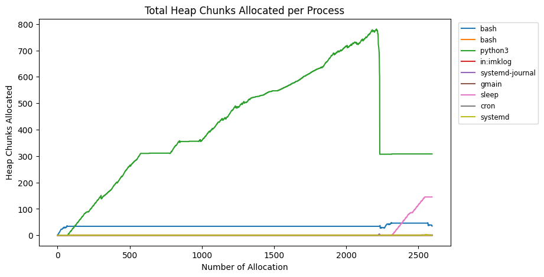

% CS4910: Binary patching for DPA
% Andrew Fasano
% Mar 8, 2022

# A03 discussion

## Part 1: Heap analysis

* Free function
* Malloc function
* `proc.c` analysis



## Part 2: Taint analysis

Just needed to configure `file_taint` and `tainted_net` plugins.

Any questions about A03?


# Static Reverse Engineering

## Background: Static Reverse engineering

Reverse engineering (RE) is the process of analyzing a system to determine how it works.

* In cybersecurity parlance, "reversing" typically means analyzing a compiled binary
statically to determine what it does.

* RE may target a program, a patch, a bug, or a whole system.

Today's lecture is a brief introduction to reversing programs.

## RE motivation

RE can answer questions such as:

* How is this program designed?
* Does this application send sensitive data to the cloud?
* Why does this error occur when the target is run?
* What would happen if {compromised cloud provider, malformed input, non-standard options}?

With the knowledge gleamed from RE, you can then:

* Decide if an application's behavior is acceptable to you
* Patch a legacy application to work in a new environment
* Upgrade an application to be compatible with a new API
* Identify vulnerabilities and craft an exploit for a program

Legality of RE gets complicated. See the EFF's [FAQ](https://www.eff.org/issues/coders/reverse-engineering-faq).

## RE tooling:

Analyzing binary data:

* String extraction: `strings`
* File identification: `file`
* File carving: `binwalk`
* Hex editors/viewers: `xxd` (with `vim`), `010 Editor`, Notepad++ [plugin](https://stackoverflow.com/a/60727840/2796854)

Parsing machine code:

* Disassembler: GDB, objdump
* Disassembler with decompiler: Ghidra, IDA, radare

These are all static analyses.
They may be guided and informed by dynamic analysis.
Or they may enable subsequent dynamic analyses.

## String analysis

Trivial static analysis to find valid strings in a compiled binary.

Searches bytes in a binary to find all sequences of printable characters that are at least *N* bytes long.

Example: my system finds 378 strings in whoami when I run:

```
$ strings /usr/bin/whoami
/lib64/ld-linux-x86-64.so.2
libc.so.6
fflush
...
```

## File identification and carving

Binary data could be anything, but often it's a known file format.
"Magic bytes" at the start of a program may specify the file type

* ELF (Linux executable): `0x7f E L F`
* EXE (Windows executable): `M Z` (short for Mark Zbikowski)
* Java Class: `0xCA 0xFE 0xBA 0xBE`
* For more, see [List of File Signatures](https://en.wikipedia.org/wiki/List_of_file_signatures) on Wikipedia

The `file` command can identify many known file types.

`binwalk` examines a binary (like string) searching for possible file headers
and "carves" these files out of a larger binary.

## Hex editors

If binary data is unencrypted it can be viewed with a hex viewer.
If it is unsigned, it can also be modified with a hex editor.

* Can directly edit binaries, configuration data, save files for games, etc.

* If file format is well known (e.g., elf, MS Word doc), format-specific
tools may work better.

* Basic differential analysis can be useful for modifying files when the format
is unknown.

## Parsing machine code

Compiled binaries are complex but important to understand:
complex and mature tools help analysts understand what they do.

* Ghidra
* IDA
* Radare2

These tools can parse compiled binaries (ELFs, PE files, etc), parse
symbol information, and present it to a user for manual analysis.

* Human-in-the-loop process: system provides initial state based off automated
static analyses, then the user can make modifications.

## Parsing machine code: Disassembly

We saw some disassembly previously with GDB's `disassemble` and `x/i` commands.
Dedicated disassemblers examine an entire program and try to generate accurate disassembly.

Addresses shown by disassembler will not match addresses seen during execution as the
base address for program is randomized at start.

Example: `objdump -d -M intel myprog`

## Aside: Anti-disassembly

Programs can be crafted to break disassemblers!

Let's walk through an example, `hello.asm`.

For more details, see [Practical Malware Analysis](https://learning.oreilly.com/library/view/practical-malware-analysis/9781593272906/) Chapter 15.
 
## Parsing machine code: Decompilation

Decompilation is the process of translating assembly code back to source code.

* Imprecise and generally won't compile - but still helpful
* Easier to understand, but less precise
* Information is lost during compilation (e.g., variable names) - some recent work
to recover using ML such as [DIRE](https://ieeexplore.ieee.org/abstract/document/8952404?casa_token=zAz6rSFtRHYAAAAA:JlBQfR3wbETZPs5qxEJKUKd5-_OPAhiCl32dbtB6ru4v-Bf0EH6COkYTptrSFWLmj3j-TyQZsg).

Challenges:

* Many-to-one mappings between source and assembly
* Compiler optimizations
* Types and type inference

# Ghidra

## Ghidra
Free and open source reverse engineering tool developed by the NSA.
Available from [https://ghidra-sre.org/](https://ghidra-sre.org/).

* Disassembles and decompiles binaries
* Patch programs to modify behavior
* Identifies cross-references ("X-refs") between functions
* Project-based with references between projects
* Supports Java and Python-based plugins

## Ghidra hands on:

Feel free to install and follow along as we:


1) Examine the main function of `prog.c` from the last assignment

* Identify strings in the binary and find the main function
* Decompile the main function
* Fix type information to get more accurate decompilation

2) Reverse engineer some of lighttpd's initialization code

* Identify main function
* Examine call graph 
* Explore interesting strings

# Binary Patching

## Binary patching for dynamic program analysis

Dynamic program analysis requires us to run a program and capture some information
about its behavior at runtime.

Using static analysis, we can identify locations where a program can be modified to aid
with a dynamic analysis.
For example, logging arguments to specific functions of interest.

This will have very high performance as the modifications will run at the same
speed as any other instructions.

## Binary patching challenges

Patches are applied after compilation so it's difficult
to manually rearrange sections of the program.

Depending on analysis goals, modifications should not break original behavior.

Standard approach is to add a jump into a "code cave" somewhere in unused memory.

## Binary patching with Ghirda

Assembly can be modified for supported architectures. New instructions must not shift
old instructions or functions to new locations.

Export patched program with File -> Export Program and select "binary" format.

## Any questions?


# Wrap up

## A04 due Thursday night

* Atypical grading scheme: easy to get a lot of points, hard to get the last few
* Office hours on Thursday as usual
* Will get grades out for A03 soon


