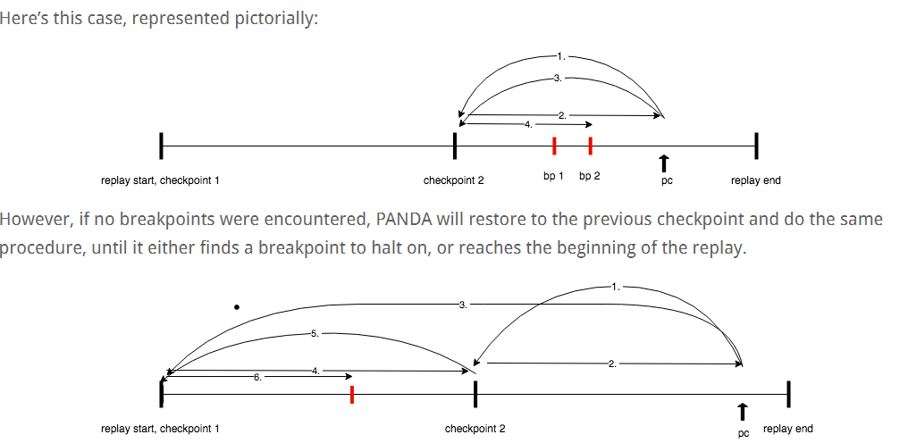

% CS4910: Timeless Debugging
% Andrew Fasano
% Mar 21, 2022

# Intro

## Recap
So far we have covered:

* Debuggers (gdb)
* Dynamic binary instrumentation (DynamoRIO, Frida)
* Sanitizers (Clang)
* Emulation/Hypervisors and introspection (PANDA.re)
* Application profiling (Valgrind, Calgrind)
* Binary patching (Ghidra)

## Remaining topics:
For the remainder of the semester we'll explore:

* Timeless Debugging (today)
* Forced Execution
* Dynamic Program Slicing
* Fuzzing
* Static analysis

We may replace one of these topics with a guest speaker depending on availability.

## Final projects: Overview

Individually or in pairs, you will complete a final project focused on:

* Solving a complex, real world problem with a dynamic program analysis.
* Building a novel dynamic program analysis and applying it to a small example.
* Improving an existing DPA system so it can be applied in a new way.

You will have four full weeks to work on the project and you should
aim to accomplish a significant task.

## Final projects: Timeline and deliverables

Project proposal: due Friday, March 27

* 1 page write-up with project description, motivation, goals.
* Feedback will be provided within a week

Project check-ins: Thursday, April 21 in place of lab

* Meetings with each group to discuss your progress to date.

Project presentations: April 26/28 (TBD)

* 10-15 minute presentation on your project.

Project write-up: due April 29th

* Code and 5-page write up in the style of a conference paper.

## Final project grading:
The final project is 20% of your total grade for the course.

You (or your team) will be graded as follows:

* 10% Proposal
* 10% Status at check-in
* 20% Presentation
* 60% Code and write-up

Rubrics for each of these will be provided via Canvas.

## Final projects: Sample project ideas

* Build and evaluate a new LLVM sanitizer to detect a new class of bugs. Evaluate the utility, performance, and stability of your sanitizer across a small corpus of programs.

* Build and evaluate a new PANDA plugin to optimize guest application performance through memoization at function or system call interface. Evaluate the utility, performance, and stability of the plugin.

* Dynamically profile one of the tools introduced in the course, modify the tool to improve its performance, consider the trade-offs introduced by your optimized code.

* Use timeless debugging to conduct a full root-cause analysis of a recent CVE where limited information is publicly available.


Any questions about final projects?


# Timeless Debugging

## Motivation

Traditionally debuggers are tightly coupled with execution state:

* Program counter is currently at $PC$, should we change it?
* Registers currently have values $V$, should we change any?
* Memory currently contains $M$, should we modify it?

This design is required for active modification, but what if you just want to
passively observe and examine target state?

## Timeless Debugging

*Record* behavior of target application as it executes, replay for analysis.
At any point in time, analyst can query memory and register state

Analysis can look *across time* and seek to specific locations for targeted analysis.

* Note the difference between program counter and instruction count


Looking across time, an analyst can see:

* When was this value last set? What was it previously?
* How many times is the current instruction run?
* When was this address next read?


## What's in a name?

There is no standard name for this type of debugging technique!

* "Timeless debugging"
* "Time-travel debugging"
* "Trace exploration"
* "Record-replay debugging"

Some slight differences between approaches, largely split between two classes:
**reversible** debugging and **timeless** debugging.


## Reversible Debugging

PANDA can provide whole-system, reversible debugging using a checkpointing system.
This works with GDB's reverse step and continue.
Image via [Ray Wang](https://raywang.tech/2018/11/14/Time-Travel-Debugging-in-PANDA).


## Reversible vs timeless debugging

Reversible debugging:

* **Navigate through time, forward or backwards**
* Collect a trace which can be run repeatedly and deterministically
* Reverse step and reverse continue

Timeless debugging:

* **Navigate through program, skip through state over time**
* Collect a trace which is analyzed to report register and memory state at program locations
* Memory and register state are connected to time and code that accesses and modifies them


Both have the same data, but how they present it to a user differs.


## Challenges in Timeless Debugging

**Big** data:

* Logs every instruction executed and details of every register/memory read/write
* Tenet claims support of up to 10 million instructions

Performance:

* Each request may require analyzing millions of instructions: e.g., when was this value modified?

Visualization:

* How can traces be best represented for end users?
* Comparisons of multiple traces


## Timeless Debuggers

* Tenet
* QIRA

These differ from reversible debuggers which we've seen previously when talking about record and replay systems (L06):

* Mozilla RR
* GDB (when using `record` command)
* PANDA (with the `checkpoint` plugin)`

# Tenet

## Tenet

Released in 2021 by [Markus Gaasedelen](https://twitter.com/gaasedelen) from [Ret2 Systems](https://ret2.io).

Open-source trace explorer built as a plugin for IDA Pro (a closed-source, expensive Ghidra alternative).

Best time travel debugging system available today. If you have access to IDA, it's worth setting up.

Tenet is a **trace explorer**, not a **trace collector**.


## Tenet traces

Tenet traces have an entry for each instruction along with register and memory modifications:
```
esp=0xcfef4,eip=0x1005f91,mr=0xcfef0:915f0001
ebx=0x0,eip=0x1005f93
esp=0xcfef0,eip=0x1005f94,mw=0xcfef0:00000000
```

Traces for tenet can be collected with Intel PIN, QEMU, and [PANDA](https://github.com/AndrewFasano/tenet_tracer).


## Tenet in action

Blog post with GIFs of Tenet exploring programs:
[blog.ret2.io/2021/04/20/tenet-trace-explorer/](http://blog.ret2.io/2021/04/20/tenet-trace-explorer/)


# QIRA

## QIRA

Released in 2014 by Geohot.

* Open-source, timeless debugging system
* Manges both trace collection and exploration
* Web-based UI or optional IDA integration

## QIRA motivation

[USENIX Enigma talk by Geohot](https://youtu.be/eGl6kpSajag?t=256) relevant until 14:13.

## QIRA container

Available in the [DPA containers](https://github.com/AndrewFasano/DPA-containers/blob/main/qira) repo.

# Wrap up

## Assignments
* A05 will be released on Thursday, due 2 weeks from today
* Final project proposals are due next Friday

## Lecture resources
* Qira video by Geohot: https://youtu.be/eGl6kpSajag?t=256
* Tenet blog post by Marcus: http://blog.ret2.io/2021/04/20/tenet-trace-explorer/
* MSRC post: https://msrc-blog.microsoft.com/2019/05/29/time-travel-debugging-its-a-blast-from-the-past/

## Any questions?
