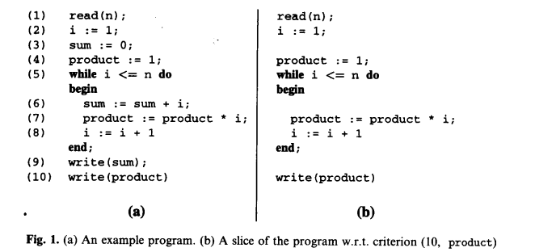
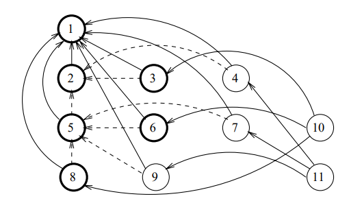
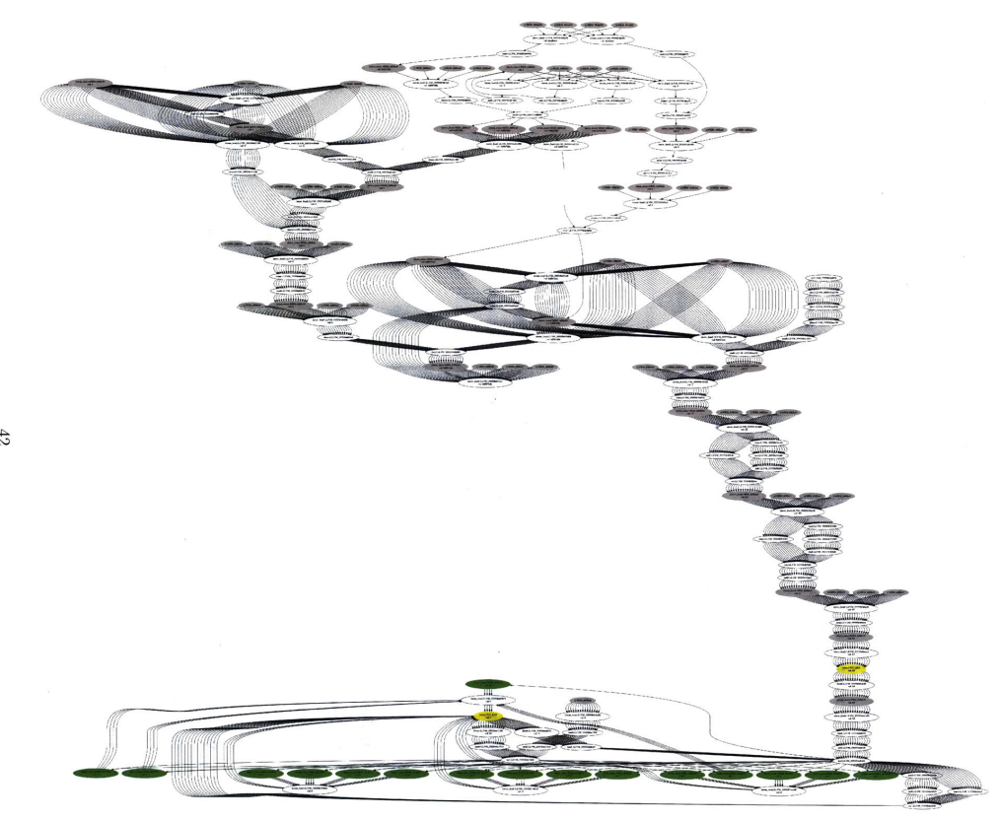

% CS4910: Dynamic Slicing
% Andrew Fasano
% April 4, 2022


# Program Slicing

## Motivation

Given a trace of execution, answer the question: *why does this variable have this value?*

This is a common question you'd ask in debugging:

* The wrong value is currently in variable `foo`: how was it calculated?

Or in exploit development:

* Did my input affect how this value was calculated?


Is these questions you'd really ask yourself when analyzing a program?

## Program slicing

Given a statement of interest and one or more values which it has computed,
a **program slice** is the parts of a program which had an effect in computing
the value(s) specified.

* Static program slicing: given a program, and a slicing criterion: identify all parts of the program which *may be* relevant.
* Dynamic program slicing: given a program, slicing criterion, and a trace: identify all the parts of the program which *were* relevant.

Slices are directed: this describes a backwards slice which is what this lecture focuses on.
A forward slice would look ahead to see how a value could influence future statements in a program.

## Slicing result

A slice of program $P$ is a new program $P'$ which contains a subset of the statements in $P$.

* *Statically-computed slices* will generate the same values specified by the slicing criterion for any input.
* *Dynamically-computed slices* will generate the same values specified for the input used for the trace.

$P$ is always a valid slice of $P$. A **statement-minimal** slice is the smallest possible slice.

Our discussion will be based on Agrawal and Horgan's 1990 paper: [Dynamic Program Slicing](https://dl.acm.org/doi/abs/10.1145/93548.93576).

## Example program slice

Figure from [Frank Tip (1994)](https://www.franktip.org/pubs/jpl1995.pdf).


## Program dependency graphs (PGDs)

For dynamic program slicing, let's consider a graph-based representation
of an input program which consists of simple (non-compound) statements:

* Each statement is a node in the graph
* Data dependency edges: An edge from node $J$ to node $K$ is present if
                         the computation in $J$ directly depends on
                         the value computed in $K$.
* Control-flow dependency edge: An edge from node $L$ to node $M$ is present if
                                the boolean result of $M$ determins if $L$ does or does
                                not run.

## Let's build a PGD

```
 1 X = GetInput()
 2 if X < 0:
 3   Y = f(x, 1)
 4   Z = g(x, 1)
   else:
 5   if X == 0:
 6     Y = f(x, 2)
 7     Z = g(x, 2)
     else:
 8      Y = f(x, 3)
 9      Z = g(x, 3)
10 print(Y)
11 print(Z)

```

## Example PGD

Image from Agrawal and Horgan, 1990.


Bold nodes are a static slide of $Y$ at statement 10.
Dashed edges are control dependencies.
Solid edges are data dependencies.

# Dynamic Program Slicing

## Dynamic program slicing

A dynamic slice is calculated on a program, a criterion (statement and variable(s)), input state
and the trace (or history) of execution.

Unlike static slices, dynamic slices can ignore untaken branches which simplifies analysis of results.

Finding a statement-minimal dynamic slice is undecidable.

## Dynamic slice example: X=-1
```
 1 X = GetInput()       
 2 if X < 0:            
 3   Y = f(x, 1)        
 4   Z = g(x, 1)        
   else:                
 5   if X == 0:         
 6     Y = f(x, 2)      
 7     Z = g(x, 2)      
     else:              
 8      Y = f(x, 3)     
 9      Z = g(x, 3)     
10 print(Y)            
11 print(Z)
```

## Dynamic slice solution
```
 1 X = GetInput()       1 X = GetInput()       
 2 if X < 0:            2 if X < 0:            
 3   Y = f(x, 1)        3   Y = f(x, 1)        
 4   Z = g(x, 1)        
   else:                
 5   if X == 0:         
 6     Y = f(x, 2)      
 7     Z = g(x, 2)      
     else:              
 8      Y = f(x, 3)     
 9      Z = g(x, 3)     
10 print(Y)             10 print(Y)             
11 print(Z)
```

## Algorithmic dynamic program slicing: naive approach

1) Create a PGD for the program
2) Mark the nodes in the PGD that were executed in the trace
3) Start from the final assignment of the target variable: traverse graph considering only marked nodes

Nodes that are traversed should be included in the slice.

Consider the prior example, slicing again on statement 10 for value $Y$
with an input of $X=-1$ which will have history

<1, 2, 3, 4, 10, 11>.

## Flaws of the naive approach

Naive approach may include extra statements in the slice.

Consider the following program with input $N=1$ with history
< 1, 2, 3, 5, 6, 7, 8, 5, 9>


```
 1 N = GetInput()
 2 Z = 0
 3 Y = 0
 4 I = 0
 5 while I <= N:
 6     Z = F(Z, Y)
 7     Y = G(y)
 8     I += 1
 9 print(Z)
```

## Flaw of the naive approach

Statements may have different data dependencies at different iterations of a loop.
For example:

* The first execution of statement 6 depends on 2 and 3
* The second execution of statement 6 depends on
the first execution 6 and 7 (which in turn depend on 2 and 3)

Distinguish between multiple executions of statements using superscript:

< 1, 2, 3, $5^1$, 6, 7, 8, $5^2$, 9>

Can we do better with this extra detail?


## Better approach

1) Build a PGD
2) For each node that was executed in the grace, mark its **edges** as dependencies arrise
3) Start from the final assignment of the target variable: traverse graph considering only marked edges.

This can lead to overly large slices in certain situations with loops, better (more complex) approaches exist, see lecture resources for more information.

## Fully dynamic slicing

A non-executable dynamic slice can be collected with a simplified version of
Korel and Laski's [approach](https://dl.acm.org/doi/10.1016/0020-0190) as described by [Dolan-Gavit](https://github.com/panda-re/panda/blob/dev/panda/docs/dynslice.md).

Given a trace of instructions, a slice can be collected by marking relevant instructions while building a working (or a "slicing") set as follows:

```
work = { initial slice variables }
for insn in reversed(trace):
  if work intersect defines(insn) != {}:
    mark(insn)
    work = work \ defines(insn)
    work = work union uses(insn)
```

# Dynamic Slicing Applications

## Dynamic slicing for reverse engineering

[Virtuoso](https://dl.acm.org/doi/10.1109/SP.2011.11) by Dolan-Gavitt et al. Virtual machine introspection system.

* Given a PANDA recording in which a guest application computes a value of interest (e.g., current process name), recreate the minimal sequence of instructions required to recover this information.
* Run these small programs on demand to provide guest introspection.

## Dynamic slicing for malware analysis

[Ray Wang's 2019 thesis](https://dspace.mit.edu/handle/1721.1/121764) uses dynamic slicing
to reverse engineer domain-generation algorithms for malware. This is heavily obfuscated code with high-value for analysts.



# Dynamic Slicing Systems

## GIRI

[GIRI](https://github.com/liuml07/giri) by Sahoo, Criswell and Adve
is a dynamic program slicer which operates on LLVM IR.

## Dynamic slicing with PANDA

Panda supports dynamic slicing by analyzing the LLVM IR.
It uses a completely different algorithm based off a "work set"
and walking through execution backwards, updating the set as necessary

See PANDA's [dynslice.md](https://github.com/panda-re/panda/blob/dev/panda/docs/dynslice.md) for more details.

## Redux

[Redux](https://www.sciencedirect.com/science/article/pii/S1571066104810478) is a dynamic dataflow tracer which uses DBI to track how variables are created.

* Implemented as a Valgrind "skin" (plugin)
* Tracks *all* variables during runtime
* Focused on system call interface to summarize the "essence" of a program's computation.


# Wrap up

## Any questions

## Remainder of the semester

No more assignments other than the final project

* Will provide feedback on proposals in the next day
* Next deliverable: Project check-in meetings on Thursday, April 21st
* After getting feedback on your proposal, you should start working on the project
before the check-in meeting.


No more labs:

* This Thursday: working time on final projects
* Next Thursday: Guest Lecture: **Dynamic analysis with IDA** by Jeremy Blackthorn
* Week after that: Project check-ins


## Lecture resources

* Agrawal, Hiralal, and Joseph R. Horgan. "Dynamic program slicing." ACM SIGPlan Notices 25.6 (1990): 246-256.
* Tip, Frank. A survey of program slicing techniques. Amsterdam: Centrum voor Wiskunde en Informatica, 1994.
* Weiser, Mark. "Program slicing." IEEE Transactions on software engineering 4 (1984): 352-357.
* Sahoo, Swarup Kumar, et al. "Using likely invariants for automated software fault localization." ASPLOS. 2013.
* Nethercote, Nicholas, and Alan Mycroft. "Redux: A dynamic dataflow tracer." Electronic Notes in Theoretical Computer Science 89.2 (2003): 149-170.
