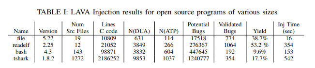
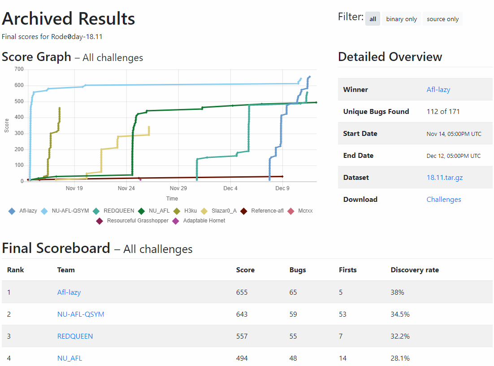

% CS4910: Fuzzing
% Andrew Fasano
% April 12, 2022


# Fuzzing

## Motivation

Many dynamic analysis tools can detect bad behavior, so long as the behavior is triggered.
Recall we previously discussed *forced execution* to trigger new behavior in an application under analysis.

But forced execution leads to unrealistic states and requires some non-trivial analyses.
How can we induce new behavior into target applications without adding unrelastic behavior?

## Fuzz Testing

**Fuzzing** (or fuzz testing) is
    the process of generating new inputs and feeding them into applications
    with the hopes of inducing previously-unseen, unexpected behavior.

Fuzzers detect when inputs trigger the target to crash and record these crashing inputs for subsequent review.

Fuzzing is often used in combination with **sanitizers** to detect unexpected state which wouldn't otherwise
cause a crash.

## Fuzzing campaign

Fuzzing is not efficient!\footnote{For more details, see Böhme, Marcel, and Brandon Falk. "Fuzzing: On the exponential cost of vulnerability discovery." FSE. 2020.}
Search space grows exponentially.

Large-scale fuzzing efforts are typically done using many cores, many machines, and for an extended period of time.
This approach is called a **fuzzing campaign**.

## Types of fuzzing

### Knowledge
**Whitebox fuzzers** use full knowledge of program source while
**graybox fuzzers** use some knowledge and **blackbox fuzzers** use none.

### Coverage-guided
**Coverage guided** fuzzers analyze the basic blocks or edges between blocks that are hit
by each execution and use this information to guide selection of future inputs.

### Directed
**Directed fuzzers** try to reach a specific point in a target.
**Undirected fuzzers** try to run previously unreached code.

# The Phases of Fuzzing

## Typical fuzzing process

### Setup

* Build target
* Harness target
* Collect seed corpus

### Run fuzzer

* Repeatedly select / generate input and run target with input
* Save input if it generates new behavior (i.e. a crash)

### Post-processing

* De-duplicate crashing inputs and conduct root cause analysis

## An exemplar fuzzer

[AFL++](https://aflplus.plus/) is one the best\footnote{It's hard to measure this precisely, we'll discuss more later} available fuzzers.
It's open source, frequently updated, and quite powerful. It is:

* Graybox
* Coverage-guided
* Undirected

If you'd like to follow along, you can pull the latest AFL++ container:

```
docker pull aflplusplus/aflplusplus
```

## A simple target

We will fuzz libxml2, an XML parsing library. First we configure it per AFL++'s [recommendation](https://aflplus.plus/docs/tutorials/libxml2_tutorial/):

```
git clone https://gitlab.gnome.org/GNOME/libxml2.git
cd libxml2
./autogen.sh --enable-shared=no
```

Note we will run these commands inside the container:

## Setup: Build target

Coverage-guided fuzzers typically ship a custom compiler which builds the target such that
it records coverage information at runtime. Alternatively, clang can be configured to record this by default.

Blocks or edges between blocks may be recorded. Typically stored in a bitmap (~64K) where covered addresses
are translated (hashed) into pixel coordinates which are then marked.

This same information could also be collected with techniques we've previously studied:

* Dynamic binary instrumentation
* Binary patching
* Emulator-based introspection


## Building libxml

We generate the program `xmlint` from libxml2 using the compiler shipped by afl++ by running:

```
make CC=afl-clang-fast CXX=afl-clang-fast++ \
    LD=afl-clang-fast
```

## Setup: Harness target

How does the target consume data, can you configure it to just do some "interesting" part?

Most fuzzers provide input to the target via a file or standard input
and many programs can (without modification) consume these.

* This may be inefficient
* The provided input may not execute the code of interest

**Harnessing** is the process of configuring a target such that your inputs
will be parsed by logic you wish to analyze.
It may involve source modifications, binary patching, configuring command line options, etc.

## Harnessing libxml2

The `xmllint` binary takes an input file name as an argument, reads that file, then parses it.
By changing the contents of this file, we can easily fuzz `xmllint`.

Let's make a directory `/tmp/fuzz` and put a copy of the binary there.

## Setup: Seed corpus

What inputs (or **test cases**) should we seed the fuzzer with?
These should be inputs which do not cause crashes
but exercise as much of the target's code as possible.

Fuzzers will perform much better when given a good seed corpus (also known as an input corpus).
Good corpora will be:

* Diverse
* Small files
* Minimized across the corpus: avoid redundant files across the corpus (can be automated: `afl-cmin`)
* Made of minimized test cases: avoid redundant data in _individual_ files (can be automated: `afl-tmin`)

## Seeds for libxml2

A set of 42 test inputs are provided by libxml in the `tests` directory: we can copy to /tmp/fuzz/inputs where we will keep our seed corpus.

## Run: input selection

Initially, a coverage-guided fuzzer just runs the provided seed corpus to measure coverage.
Then it will **mutate** the inputs in the hopes of getting more coverage.

Many different approaches here:

* "Havoc mode": swap patterns/apply transformations across entire input
* Bit-flips: change 0s to 1s and vice-versa
* Arithmetic: Modify bytes that look like small integers
* Splice: take part of two previous inputs and combine them

Example [AFL mutations of a JPEG](https://lcamtuf.coredump.cx/afl/rabbit.gif).

## Fuzzing libxml2

We launch afl++ with:

```
afl-fuzz -i inputs/ -o out -m none -d -- ./xmllint @@
```

Seeds are read from `inputs/`, outputs are saved to `out/`.
The `-d` flag alters the mutator to skip some of the deterministic transformations (e.g., bitflips).

Finally, `--` separates the program to be run: `./xmllint @@`.
The `@@` gets replaced by the name of generated inputs. 

# Fuzzing in the real world
## Other popular fuzzers

* AFL variants: AFL, AFL++, AFLfast, 
* Eclipser
* Redqueen
* Hongfuzz

## State of the art
Fuzzing has become a very active research area since ~2015.\footnote{See Manès, Valentin JM, et al. "The art, science, and engineering of fuzzing: A survey." TSE 2019}
Some notable innovations are:

* Comparison splitting
* Dictionary extraction
* Black-box support (i.e., qemu)
* Differential fuzzing
* Anti-AFL techniques


## Fuzzer evaluations

How can you describe how good a fuzzer is?

. . .

Is getting more coverage always better?

. . .

What about finding bugs?

. . .

Are there enough bugs to do these sorts of evaluations?

## LAVA

In 2016, Dolan-Gavitt et al. released **LAVA**, a (PANDA-based) system to inject *synthetic
bugs* into target programs.

LAVA enabled better evaluation of bug-finding systems (in particular, fuzzers) by removing
the scarcity of real bugs. 
.

## Rode0day

Using LAVA, we ran a [bug-finding competition](https://rode0day.mit.edu) 2018-2020.
Ever month, competitors were given "buggy binaries" that were created with various bug-injection techniques (mostly LAVA) and challenged to find as many bugs as they could.
{height=300}.

## The value of synthetic bugs

Synthetic bugs are controversial - do they look like real bugs? What do real bugs look like?

In 2021, Bundt et al. did a large-scale evaluation of some of the Rode0day targets using 8 fuzzers run for more than 80 years of CPU time.

* 0 unknown vulnerabilities were discovered
* The LAVA-injected bugs were easier to find than (now) known real vulnerabilities present in the targets
* Synthetic bug injection is biased towards adding bugs to "common" code paths while real bugs are typically in uncommon paths.


# Wrap Up

## Hands on

If we have time, let's try fuzzing a program you've written for or used in another class.

There will be no lab this week because we have a guest speaker **Jermey Blackthorn** presenting on Thursday. We will meet in **ISEC 136**.

## Lecture resources
* Böhme, Marcel, et al. "Directed greybox fuzzing." Proceedings of the 2017 ACM SIGSAC Conference on Computer and Communications Security. 2017.
* [aflplus.plus/docs/tutorials/llvm2_tutorial](https://aflplus.plus/docs/tutorials/libxml2_tutorial/)
* [github/google/afl/docs/technical_details.txt](https://github.com/google/AFL/blob/master/docs/technical_details.txt)
* Dolan-Gavitt, Brendan, et al. "LAVA: Large-scale automated vulnerability addition."  IEEE SP. 2016.
* Fasano, Andrew, et al. "The rode0day to less-buggy programs." IEEE Security and Privacy 17.6. 2019
* Bundt, Joshua, et al. "Evaluating Synthetic Bugs." AsiaCCS. 2021.

