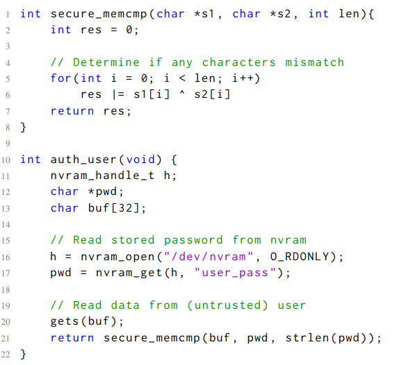
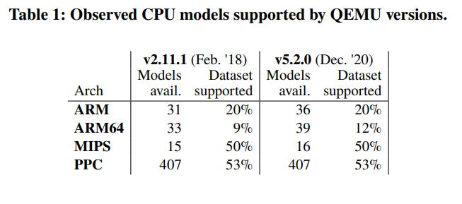
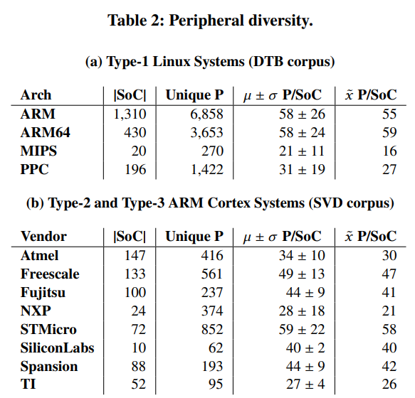
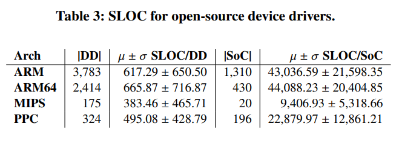
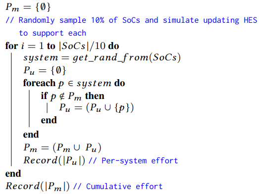
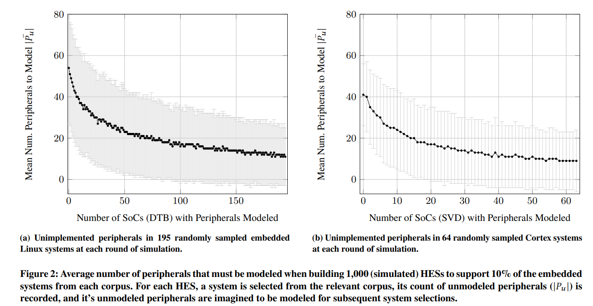
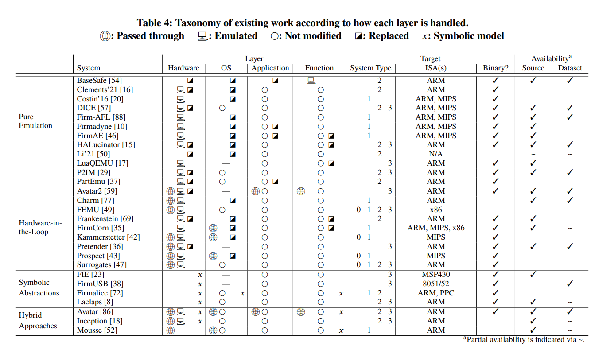
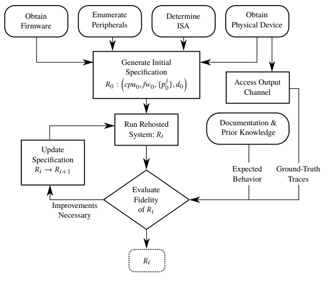

% CS4910: Rehosting
% Andrew Fasano
% April 26, 2022

# Rehosting

## Motivation

We have all these great dynamic analysis tools, but how can we use them on a smart thermostat? What about an airplane?

We need a way to observer and mutate the details of a running system.

* We can do this with a program running in our computer
* But this ranges from difficult to impossible for *embedded systems*

## Embedded systems: Overview

**Embedded systems** are a combination of hardware and software which work to perform a dedicated task in the real world.
The **firmware** of an embedded system is the code the system runs. Example embedded systems include:

* A Nest thermostat
* A digital camera
* An internet-enabled door lock

How do these types of systems compare to a general purpose computer?

## Embedded systems: External interactions

Embedded systems interact with the external world through **peripherals** such as
sensors, radios, displays, etc.

Embedded systems interact with peripherals via various interfaces, most commonly
memory mapped input/output (MMIO) or direct memory access (DMA).

## Rehosting vs emulation: Definitions

**Virtual Environment** (VE): A software environment
in which code can be executed transparently.

**Hardware Emulation System** (HES): A VE designed
to accurately recreate the features of one or more selected pieces of
hardware. Commonly called an emulator.

**Rehosted Embedded System** (RES): A combination
of a firmware image and VE designed to sufficiently recreate the
firmware's hardware dependencies such that analyses produce results representative of the firmware running on its original hardware.

**Rehosting**: The process of building an RES for a given
embedded system to enable a specified analysis task. May include
modifications to the firmware.

## Rehosting vs emulation

Rehosting is focused on a specific firmware: build a VE to run this embedded system however you can. E.g.,: One IoT camera.

Emulation is focused on a specific platform: build a VE which can run any code that this system ran: E.g., a Nintendo Gamecube.

## The advantages of VEs

In a VE, systems are:

* Inspectable: You can see precisely what they do
* Scalable: You can run many at once
* Disposable: There's no cost to throw one away
* Mutable: You can mutate state at anytime
* Replicable: You can repeat results

How do these capabilities enable some of the dynamic analyses we've discussed this semester?

## Layers of an embedded system

Consider a system as a combination of the following layers:

* **Function layer**: Logic within user space applications
* **Application layer**: The applications that are run
* **OS layer**: The operating system (optional in embedded systems)
* **Hardware layer**: CPU and peripherals that interact with the external world

Vulnerabilities in an embedded system may lie entirely within one layer or span across multiple.

## Multi-layer vulnerabilities: Example

{height=225}.

There are 3 potential bugs in this code. Can you see any?

## Multi-layer vulnerabilities: Bugs

1) Buffer overflow from *gets*.

2) NVRAM interactions may return NULL depending on peripheral behavior.
 
3) The `secure_memcmp` function may be vulnerable to timing side channels if the underlying hardware executes OR and XOR at different speeds when different data are present.

### Rehosting accuracy

Security analyses conducted using a VE which fail to capture the behavior of one of these layers
or modify them altogether may lead to inaccurate analysis results.

# Rehosting Challenges

## Obtaining firmware

Unlike with a general purpose machine, possession of an embedded system does not imply access to its (compiled) code.

Hardware manufacturers often invest in significant anti-tamper mechanisms and use encryption-at rest
to prevent firmware extraction.

These techniques can be bypassed using hardware-invasive attacks such as:

* Scanning electron microscopes
* Focused ion beams

When available, software-based techniques are much easier:

* Downloading or intercepting firmware updates
* Software exploitation

## Understanding instruction set architectures (ISAs)

Embedded systems use a variety of ISAs, not just `x86_64` like we often see with desktop systems.

Rehosting systems must understand and support the ISA used by a guest, e.g., ARM, MIPS, PPC, or AVR.

Some silicon vendors support various extensions and customizability of their ISAs.

This understanding is captured in a **Virtual Execution Enginge** (VXE): A mechanism for
interpreting instructions for a given ISA in a VE.

## Modeling peripherals
General purpose computers typically use peripheral enumeration to dynamically
discover connected devices (e.g., via USB or PCI).

Embedded systems are generally *tightly-coupled* with the peripherals they were
designed to use. If peripherals are missing, the system will likely fail to behave
properly (i.e., fail to boot).

VEs must generally model peripherals to ensure that target firmware fill run correctly.
Also note that peripherals are always the source of attacker-controlled data.

## Evaluating fidelity

The **fidelity** of an RES describes how accurately its behavior mirrors its physical
counterpart.

Formally defining this is challenging and it has never been analyzed at a large scale.
In the general case, this is an unsolvable problem!

Current state of the art is very distinct, so meaningful measurements can be made by:

* checking if a web server starts
* comparing peripheral interactions to a real system
* comparing the sequence of instructions executed to a real system

# The Difficulty of Rehosting

## Dataset

We examined 1,956 Device Tree Blob (DTB) and 618 System View Description (SVD) files which
describe the hardware configurations of various systems-on-a-chip (SoCs): real world embedded systems.

For these 2,574 systems, we examine:

1)  VXE availability by contrasting corpora CPU models against those supported in QEMU (an HES)
2)  VE diversity  by measuring the number of unique peripherals in corpora SoCs
3)  VE complexity by measuring the complexity of corpora SoCs as a function of peripheral driver code size
4)  Tractability of HES implementation by simulating VE creation to measure transferable work

## Availability: Virtual execution engines

{height=200}
QEMU support for these CPU models is low and barely improving over time.

## Diversity: Unique peripherals

Our corpus shows a significant and diverse quantity of peripherals.  QEMU supports just a few hundred of these for each arch.
{height=200}

## Complexity: Driver SLOC as a proxy
{height=200}
Using code for device drivers, we can estimate the complexity of all these peripherals.
On average, there are 43k lines of code for the drivers on an ARM SoC.

## Tractability: Monte Carlo simulation

Are there a lot of peripherals commonly used and then a few systems with a lot of unique ones?

We evaluate this through a *Monte Carlo simulation* were we run a randomized experiment many
times and observe the average behavior. 

We run the following 1,000 times for the two types of systems described by our corpus:

{height=100}

## Simulation results
Even after significant manual effort, rehosting additional systems does not become easy.
{height=200}

# State of the Art

## Taxonomy

We identify four categories for existing approaches to rehosting:

### Pure emulation

Traditional approach: build virtual models of all used peripherals. Not necessary to modify other layers of the system.
May hook hardware interactions at higher levels of abstraction when possible and build models there.

### Hardware-in-the-loop

Forward OS-hardware interactions from the VE to a physical system.
Highly accurate, but difficult to scale and requires complex, per-system configuration.

## Taxonomy

### Symbolic Abstractions

Treat all input from peripherals a **symbolic** and run a symbolic execution to explore
all reachable system states. **Over-approximates** system behavior and suffers from
state explosion.

### Hybrid Approaches

Combine hardware-in-the-loop based approaches with symbolic abstractions.

## State of the art taxonomy

# Rehosting Process

## Iterative refinement

An imperfect attempt to rehost a system can reveal flaws in the rehosting.
While a system is flawed, it should not be used for dynamic analyses of the system,
but analysis of the flaws can reveal how to improve the rehosting.

Let's call $R_0$ the initial specification of a system which includes:

* $cpu_i$: The VXE at iteration $i$
* $fw_i$: The firmware at iteration $i$
* ${p_i^j}$: Peripheral $j$ at iteration $i$
* Configuration data $d$

## Process

# Wrap Up

## Any questions?

* Last class meeting on Thursday: Project presentations.
* Project code and write ups due end of day Friday.

## Lecture resources
* Fasano, Andrew, et al. "SoK: Enabling Security Analyses of Embedded Systems via Rehosting." Proceedings of the 2021 ACM Asia Conference on Computer and Communications Security. 2021.
